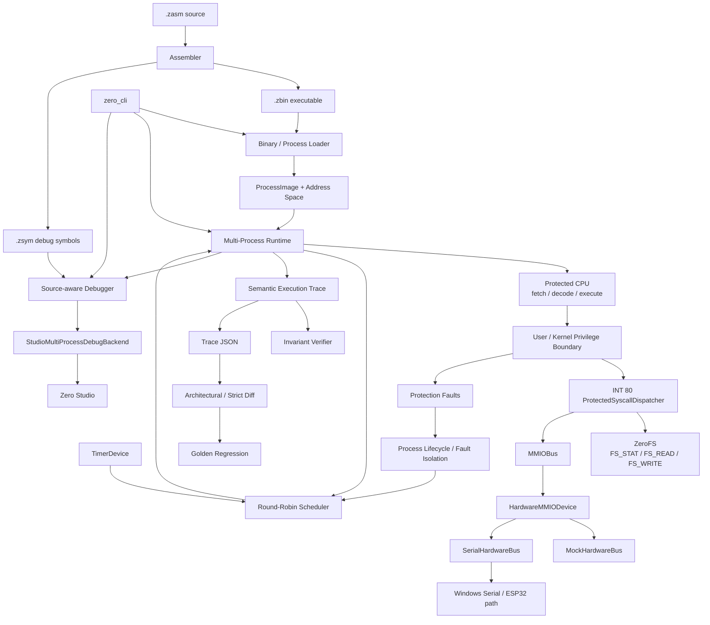
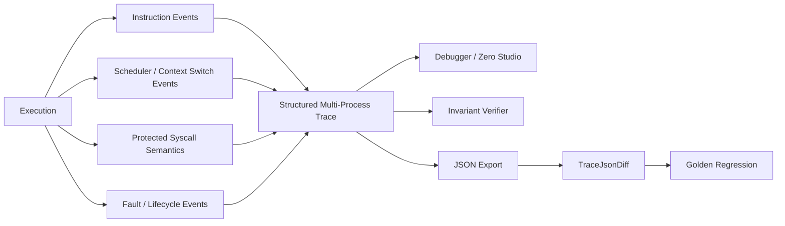

# Zero-CPU Current Architecture

Zero-CPU is a **verifiable and observable protected virtual computer platform**.

This document is the current architecture map for the v2.0 productization
boundary. Older milestone-specific architecture notes may remain in the
repository as history, but this document describes the current platform.

## 1. Platform Architecture



The important architectural rule is that CLI and Studio are **consumers of the
core runtime/debugger behavior**. They do not implement a second execution
model.

## 2. Canonical Executable Path

```text
.zasm
  → Assembler
  → .zbin
  → Binary / Process Loader
  → process memory image
  → CPU fetch / decode / execute
```

`.zsym` is a sidecar used for symbols and source-line mapping. It does not
replace the executable path.

The older in-memory instruction path remains useful for focused tests and
compatibility, but `.zasm → .zbin → loader → CPU` is the canonical executable
architecture.

## 3. Protected Execution Boundary

The protected machine has explicit `User` and `Kernel` privilege levels.

```text
User process
  │
  ├─ normal RAM/code access ─────────────── allowed within its ranges
  │
  ├─ direct MMIO / Kernel-only access ──── protection fault
  │
  └─ INT 80
       ↓
     protected interrupt frame
       ↓
     Kernel mode
       ↓
     ProtectedSyscallDispatcher
       ↓
     validated runtime service
       ↓
     restore User frame OR terminate process
```

The CPU owns the User→Kernel transition and protected interrupt frame. The
dispatcher provides host-side protected services; it does not bypass CPU
privilege semantics.

## 4. Process and Scheduling Model

Each process owns independent execution state:

```text
registers
PC / SP
memory image
code range
lifecycle state
exit / fault information
```

The multi-process runtime coordinates:

```text
ProcessTable / PCB
ProcessAddressSpace
ProcessContext
ProcessLifecycleManager
RoundRobinScheduler
TimerPreemptiveScheduler
```

Timer-driven preemption and lifecycle handoff are observable in the same
multi-process trace used by the debugger and regression tests.

A faulted process is terminated in isolation. Another ready process can continue
from its own address space and saved context.

## 5. Protected Runtime Services

The current protected host ABI uses `INT 80`.

```text
3   process exit

20  hardware write
21  hardware read

30  filesystem stat
31  filesystem read
32  filesystem write
```

Filesystem services use validated User-memory request blocks and buffers.
ZeroFS is deterministic host-side storage and is separate from the guest's
4 KiB RAM image.

Hardware services reach the shared hardware MMIO window only from protected
Kernel context:

```text
User
  → INT 80
  → ProtectedSyscallDispatcher
  → MMIOBus
  → HardwareMMIODevice
  → MockHardwareBus
     or SerialHardwareBus
```

The mock path is the deterministic v2.0 baseline. The serial/ESP32 path is an
optional physical extension.

## 6. Memory and Device Map

```text
Guest RAM
0x0000..0x01FF  User data / low memory
0x0200..        loaded executable code
0x0800..0x0F9F  User stack
0x0FA0..0x0FFF  Kernel interrupt stack

MMIO
0xF000..0xF00F  DebugOutputDevice
0xF100..0xF12F  TimerDevice
0xF200..0xF22F  Hardware bridge
```

Hardware bridge offsets:

```text
+0   GPIO output
+8   GPIO input
+16  PWM output
+24  ADC input
+32  status
+40  command
```

## 7. Observability and Verification

Observability is part of the correctness model.



The system records semantic syscall fields such as service, status, result,
disposition, and exit code. Verification therefore does not need to infer
syscall meaning from console text or raw register changes.

## 8. End-to-End Showcase Mapping

The v1.9 showcase crosses the main architecture boundaries in one deterministic
run:

```text
Process 1
  FS_READ
    ↓
Process 2
  HW_WRITE(GPIO=42)
    ↓
Process 2
  illegal direct User MMIO
    ↓
protection fault
    ↓
lifecycle termination / scheduler handoff
    ↓
Process 1 survives
    ↓
FS_WRITE
    ↓
HELLOHELLO
    ↓
exit 0
    ↓
runtime Completed
```

That execution is observed by:

```text
MultiProcessDebugSession
Zero Studio
semantic syscall history
context-switch history
trace JSON
invariant verifier
golden trace regression
```

The showcase therefore demonstrates **integration**, not a separate demo-only
execution implementation.

## 9. Frontend Boundary

```text
Core machine/runtime
  ├─ zero_cli
  ├─ DebugSession
  └─ MultiProcessDebugSession
        ↓
      StudioMultiProcessDebugBackend
        ↓
      Zero Studio
```

Zero Studio may add presentation state and controls, but execution semantics stay
in the core/runtime/debugger layers.

## 10. v2.0 Boundary

The architecture is feature-frozen for v2.0.

The release boundary includes:

```text
custom ISA + assembler
versioned .zbin executable
protected User / Kernel CPU
processes + independent address spaces
timer-driven preemptive scheduling
fault isolation
protected hardware and filesystem syscalls
MMIO / mock / serial hardware abstraction
ZeroFS storage
source-aware debugger
multi-process debugger
Zero Studio
trace / invariant / diff / golden verification
end-to-end showcase
```

The following are deliberately outside v2.0:

```text
cache / pipeline / branch-prediction simulation
network stack
general-purpose filesystem expansion
GPU / 3D
Linux or x86 compatibility
```

The v2.0 goal is not a wider feature set. It is a clear, reproducible, verified
presentation of the protected virtual computer already implemented.

<!-- Patch: v2.0-current-architecture-diagram-r1 -->
