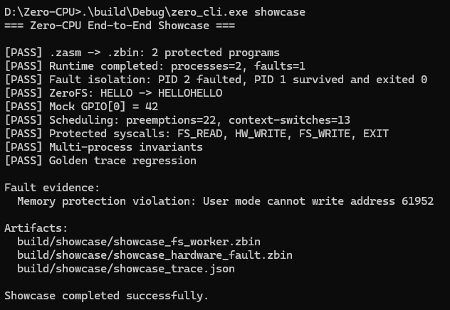
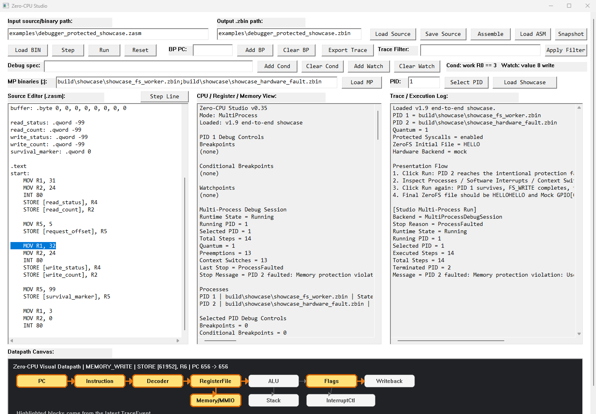
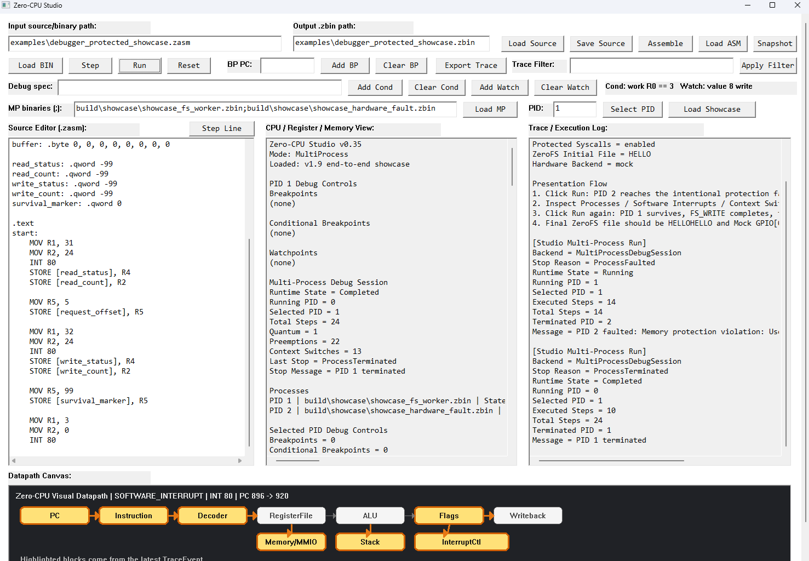

# Zero-CPU v2.0 Demo Guide

This guide defines the short portfolio / graduation-project presentation for the
v2.0 release boundary.

The goal is to explain one complete protected execution path in about **2 minutes
30 seconds**, rather than listing every Zero-CPU feature independently.

## 1. Demo Goal

The presentation should make one causal chain clear:

```text
real .zasm programs
  → .zbin executables
  → independent processes
  → timer preemption
  → protected filesystem syscall
  → protected hardware syscall
  → illegal User-mode MMIO access
  → isolated process fault
  → survivor continues
  → normal exit
  → invariant verification
  → golden trace regression
```

The central claim is not that Zero-CPU contains many unrelated components. The
claim is that protection, scheduling, syscalls, storage, devices, debugging, and
verification are connected in one reproducible execution.

## 2. Assets

The v2.0 portfolio screenshots are:

```text
docs/assets/v2.0/showcase-cli.png
docs/assets/v2.0/showcase-fault-phase.png
docs/assets/v2.0/showcase-complete-phase.png
```

### CLI verification



This screenshot shows the public `zero_cli showcase` command verifying:

```text
two .zasm → .zbin programs
processes = 2
faults = 1
PID 1 survivor exit = 0
ZeroFS HELLO → HELLOHELLO
Mock GPIO[0] = 42
preemption / context switches
protected syscall observations
multi-process invariants
golden trace regression
```

### Studio fault phase



The first Studio Run stops on the intentional PID 2 protection fault while the
runtime remains active and PID 1 is still able to continue.

### Studio completion phase



The second Studio Run completes the survivor path. PID 1 finishes normally after
the other process has already faulted.

## 3. Before Presenting

Build the current Debug configuration:

```bat
cmake --build build --config Debug
```

Verify the public showcase command:

```bat
.\build\Debug\zero_cli.exe showcase
```

For the Studio presentation:

```bat
.\build\Debug\zero_studio.exe
```

Then:

```text
Load Showcase
Run once   → fault phase
Run again  → completion phase
```

Do not use physical ESP32 hardware for the canonical v2.0 presentation. The mock
hardware path is deterministic and is the release baseline.

## 4. 2–3 Minute Presentation Script

### 0:00–0:20 — What Zero-CPU is

**Screen:** README 30-Second Overview or `docs/architecture.md`.

Suggested narration:

> Zero-CPU is a protected virtual computer platform written in C++17. It combines
> a custom ISA and executable toolchain with User/Kernel protection, independent
> processes, preemptive scheduling, protected syscalls, MMIO devices, ZeroFS,
> debugging, and trace-based verification. The point is not to emulate a
> commercial CPU, but to make important system boundaries observable and
> testable end to end.

Do not spend this opening section enumerating individual opcodes.

### 0:20–0:55 — Run the complete scenario

**Screen:** terminal.

Run:

```bat
.\build\Debug\zero_cli.exe showcase
```

Suggested narration:

> The public showcase command assembles two real `.zasm` programs into `.zbin`
> executables and loads them as independent protected processes. PID 1 uses the
> protected filesystem path. PID 2 first writes 42 through the protected hardware
> syscall and then intentionally attempts a direct User-mode MMIO write.

Point to:

```text
Runtime completed: processes=2, faults=1
PID 1 survived and exited 0
ZeroFS: HELLO -> HELLOHELLO
Mock GPIO[0] = 42
```

Then say:

> The important part is that the protection violation kills only PID 2. PID 1
> survives and finishes normally.

### 0:55–1:35 — Observe the isolated fault in Studio

**Screen:** Zero Studio.

Actions:

```text
Load Showcase
Run
```

Suggested narration:

> The same scenario can be inspected in Zero Studio. The showcase uses timer
> quantum 1 so the two processes are repeatedly preempted. On the first Run, PID
> 2 reaches its illegal direct MMIO access and the debugger stops on
> `ProcessFaulted`.

Point to the visible evidence:

```text
Runtime State = Running
Stop Reason = ProcessFaulted
faulted / terminated PID = 2
PID 1 remains available to run
```

If visible, also point to the offending instruction:

```text
STORE [61952], R6
```

Then explain:

> Address 61952 is `0xF200`, the hardware MMIO window. User mode cannot access
> that range directly, so the access is rejected at the protection boundary.

### 1:35–2:05 — Let the survivor finish

**Screen:** same Studio session.

Action:

```text
Run
```

Suggested narration:

> Running again resumes the surviving PID 1. It performs the protected
> filesystem write and exits normally. The runtime then reaches `Completed`.

Point to:

```text
Runtime State = Completed
PID 1 normal termination
PID 2 fault termination
ZeroFS final content = HELLOHELLO
Mock GPIO value = 42
```

Then say:

> The fault in PID 2 did not corrupt PID 1's address space or prevent the
> survivor from completing its own filesystem work.

### 2:05–2:30 — Explain why the demo is verifiable

**Screen:** return to CLI output, or show the generated trace path.

Point to:

```text
Multi-process invariants
Golden trace regression
build/showcase/showcase_trace.json
```

Suggested narration:

> This is not only a visual demo. The same run records structured process,
> instruction, syscall, context-switch, and fault information. Zero-CPU checks
> multi-process invariants, exports the trace to JSON, and compares the result
> against a committed golden trace. That makes the system behavior reproducible
> and regression-testable.

Close with:

> Zero-CPU is small, but protection, multi-process scheduling, syscalls, virtual
> devices, storage, debugging, and verification can all be observed in one
> execution flow.

## 5. What to Emphasize

Prefer this explanation:

```text
protected operation
→ preemption
→ protected hardware access
→ illegal direct access
→ isolated fault
→ scheduler handoff
→ survivor progress
→ normal completion
→ deterministic verification
```

Avoid presenting Zero-CPU as only a checklist such as:

```text
CPU
assembler
filesystem
debugger
GUI
```

The integrated causal path is the stronger systems-software story.

## 6. Evidence Map

| Claim | Evidence |
|---|---|
| Real executable toolchain | `.zasm → .zbin` in `zero_cli showcase` |
| Independent protected processes | PID 1 / PID 2 runtime state |
| Timer preemption | preemption and context-switch counters |
| Protected hardware service | `HW_WRITE`, Mock GPIO `42` |
| Direct User MMIO is blocked | PID 2 fault at hardware MMIO address |
| Fault isolation | PID 1 continues after PID 2 termination |
| Protected storage service | `FS_READ`, `FS_WRITE`, `HELLOHELLO` |
| Normal survivor completion | PID 1 exit code `0` |
| Observable semantics | Studio state + semantic syscall history |
| Reproducible verification | invariants + JSON + golden regression |

## 7. Release Presentation Boundary

For v2.0, the canonical demonstration is:

```text
public CLI showcase
+ Zero Studio two-Run presentation
+ deterministic mock hardware
+ committed screenshots
+ invariant/golden verification
```

The serial / ESP32 path remains an optional physical extension. It is not needed
to demonstrate the protected hardware architecture or to reproduce the v2.0
showcase.

<!-- Patch: v2.0-demo-guide-r1 -->
